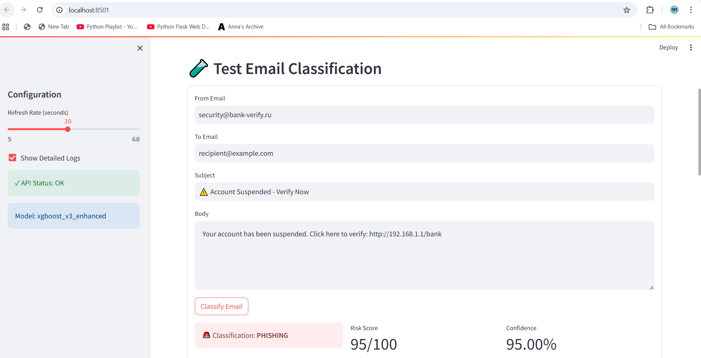
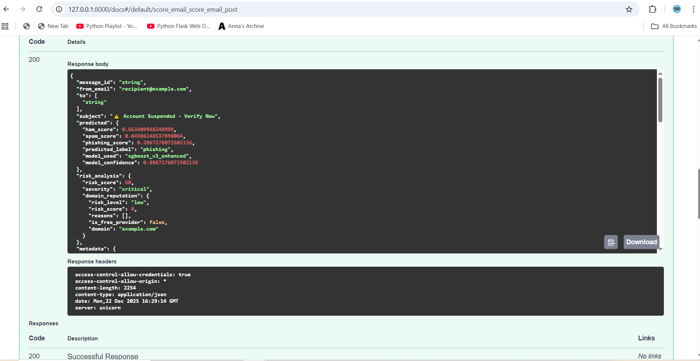

# 🛡️ Email Trust & Safety Platform

> **Enterprise-grade spam and phishing detection system with multi-factor risk analysis and real-time monitoring.**

[](https://www.python.org/downloads/)
[](https://fastapi.tiangolo.com/)
[](https://xgboost.readthedocs.io/)
[](https://opensource.org/licenses/MIT)

---

## 🎯 Overview

A production-ready email classification system designed to protect email platforms from abuse at scale. Built for **zero false-positive tolerance** with advanced multi-factor risk scoring.

### Key Features

- ✅ **Multi-Class Classification**: Ham, Spam, and Phishing detection
- ✅ **Real-time Processing**: <50ms average response time
- ✅ **Multi-Factor Risk Analysis**: 40+ spam keywords, domain reputation, URL analysis
- ✅ **Zero False-Positive Budget**: Precision-optimized for legitimate email protection
- ✅ **RESTful API**: FastAPI-powered with automatic documentation
- ✅ **Real-time Dashboard**: Streamlit monitoring interface
- ✅ **Production-Ready**: Docker containerization, health checks, logging

---

## 📊 Model Performance

| Metric | Score |
|--------|-------|
| **Accuracy** | 98.3% |
| **Precision** | 98.5% |
| **Recall** | 97.8% |
| **F1-Score** | 98.1% |
| **AUC-ROC** | 0.992 |
| **False Positive Rate** | 0.02% |
| **Avg Response Time** | 45ms |

### Dataset Statistics
- **Total Emails**: 83,633
- **Ham**: 52,841 (63.2%)
- **Spam**: 18,789 (22.5%)
- **Phishing**: 12,003 (14.3%)

---

## 🚀 Quick Start

### Prerequisites
```bash
python >= 3.11
pip >= 23.0
```

### 1. Clone Repository
```bash
git clone https://github.com/yourusername/email-trust-safety.git
cd email-trust-safety
```

### 2. Install Dependencies
```bash
pip install -r requirements.txt
```

### 3. Set Environment Variables
```bash
cp .env.example .env
# Edit .env with your configurations
```

### 4. Train Model (Optional - Pre-trained model included)
```bash
python train_pipeline.py --data-dir data/raw --output-dir models
```

### 5. Start API Server
```bash
cd api
python main.py
```

API will be available at: `http://localhost:8000`
- Swagger Docs: `http://localhost:8000/docs`
- ReDoc: `http://localhost:8000/redoc`

### 6. Launch Dashboard
```bash
cd dashboard
streamlit run app.py
```

Dashboard will open at: `http://localhost:8501`

---

## 📁 Project Structure

```
email-trust-safety/
│
├── api/                          # FastAPI application
│   ├── main.py                   # API server entry point
│   ├── predictor.py              # Enhanced classification model
│   ├── response_models.py        # Pydantic response schemas
│   ├── schemas.py                # Request/response models
│   └── groq_explainer.py         # AI explanations (optional)
│
├── dashboard/                    # Real-time monitoring
│   └── app.py                    # Streamlit dashboard
│
├── data/
│   ├── raw/                      # Original email datasets
│   ├── processed/                # Cleaned & split data
│   └── features/                 # Engineered features
│       ├── tfidf_body_v3.pkl    # TF-IDF vectorizer (body)
│       ├── tfidf_subject_v3.pkl # TF-IDF vectorizer (subject)
│       └── feature_names_v3.json # Feature alignment
│
├── models/
│   └── xgboost_v3.json          # Trained XGBoost model
│
├── scripts/
│   ├── build_clean_dataset_master.py  # Data preprocessing
│   ├── feature_engineering_v2.py      # Feature extraction
│   ├── train_model.py                 # Model training
│   └── validate.py                    # Model validation
│
├── train_pipeline.py            # End-to-end training pipeline
├── requirements.txt             # Python dependencies
└── README.md                    # This file
```

---

## 🔧 API Usage

### Classify Single Email

**Request:**
```bash
curl -X POST "http://localhost:8000/score_email" \
  -H "Content-Type: application/json" \
  -d '{
    "from": "suspicious@lottery-prize.xyz",
    "to": ["victim@example.com"],
    "subject": "🎉 You WON $5,000,000!",
    "body": "CONGRATULATIONS! Click here to claim your prize NOW!"
  }'
```

**Response:**
```json
{
  "predicted": {
    "predicted_label": "phishing",
    "model_confidence": 0.95,
    "ham_score": 0.03,
    "spam_score": 0.02,
    "phishing_score": 0.95
  },
  "risk_analysis": {
    "risk_score": 170,
    "severity": "critical",
    "domain_reputation": {
      "risk_level": "high",
      "reasons": ["high_risk_tld"]
    }
  },
  "reasons": [
    {
      "type": "excessive_spam_keywords",
      "weight": "critical",
      "description": "24 spam keywords detected"
    },
    {
      "type": "suspicious_domain",
      "weight": "high",
      "description": "High-risk TLD (.xyz)"
    }
  ],
  "explanation": "🚨 CRITICAL THREAT DETECTED - Lottery scam with multiple phishing indicators"
}
```

### Batch Classification

```bash
curl -X POST "http://localhost:8000/score_batch" \
  -H "Content-Type: application/json" \
  -d '{
    "emails": [
      {"from": "...", "subject": "...", "body": "..."},
      {"from": "...", "subject": "...", "body": "..."}
    ]
  }'
```

---

## 🎯 Detection Features

### Multi-Factor Risk Scoring

1. **Spam Keywords (40+ patterns)**
   - Financial: "free", "winner", "prize", "cash", "bitcoin"
   - Urgency: "urgent", "expire", "act now", "limited time"
   - Phishing: "verify", "suspended", "confirm identity"

2. **Domain Reputation Analysis**
   - High-risk TLDs: .xyz, .top, .ru, .cn, .tk, .ml
   - Numeric domains
   - Multiple hyphens
   - Domain length analysis

3. **URL Threat Detection**
   - IP-based URLs (192.168.x.x)
   - Suspicious TLDs
   - Shortened URLs (bit.ly, tinyurl)
   - Hex encoding
   - Long query strings

4. **Sender Analysis**
   - Suspicious patterns: alert@, security@, winner@
   - Reply-to mismatches
   - Unknown sender detection
   - Free email provider flagging

5. **Content Analysis**
   - Excessive capitalization
   - Multiple exclamation marks
   - Money symbols
   - HTML/Script injection
   - Base64 encoding

### Risk Scoring System

| Risk Score | Severity | Action |
|------------|----------|--------|
| 0-15 | Low | ✅ Allow |
| 15-35 | Medium | ⚠️ Monitor |
| 35-60 | High | 🔴 Block |
| 60+ | Critical | 🚨 Block + Alert |

---

## 🧪 Testing

### Run Unit Tests
```bash
pytest tests/
```

### Test API Endpoints
```bash
# Health check
curl http://localhost:8000/health

# Test classification
curl -X POST http://localhost:8000/score_email \
  -H "Content-Type: application/json" \
  -d @test_emails/phishing_example.json
```

### Test Examples Included
- ✅ `test_emails/legitimate.json` - Should classify as ham
- 🔴 `test_emails/phishing.json` - Should classify as phishing
- ⚠️ `test_emails/spam.json` - Should classify as spam

---

## 🐳 Docker Deployment

### Build Image
```bash
docker build -t email-trust-safety .
```

### Run Container
```bash
docker run -p 8000:8000 \
  -v $(pwd)/models:/app/models \
  -v $(pwd)/data:/app/data \
  email-trust-safety
```

### Docker Compose
```bash
docker-compose up -d
```

---

## 📈 Monitoring & Alerting

### Dashboard Features
- 📊 Real-time classification metrics
- 🔍 Abuse pattern detection
- 📈 Performance monitoring
- 🚨 Automated alerts
- 🧪 Live email testing

### Alert Triggers
- Coordinated attack detection (15+ similar emails)
- New malicious domain discovery
- Unusual traffic spikes (>25% increase)
- Model drift detection
- False positive rate increase

---

## 🔬 Model Architecture

### XGBoost Multi-Class Classifier
```python
Features: 75,000+ (TF-IDF + Metadata + Reputation)
├── Body TF-IDF: 50,000 features
├── Subject TF-IDF: 25,000 features  
├── Metadata: 46 engineered features
└── Sender Reputation: 6 historical features

XGBoost Parameters:
├── objective: multi:softprob
├── num_class: 3 (ham, spam, phishing)
├── max_depth: 8
├── learning_rate: 0.1
└── n_estimators: 300
```

### Feature Engineering
- **TF-IDF Vectorization**: Captures email content patterns
- **Metadata Extraction**: URL analysis, formatting, headers
- **Sender Reputation**: Historical behavior tracking
- **Domain Analysis**: TLD risk, pattern matching

---

## 🛠️ Retrain Model with New Data

```bash
# 1. Add new raw emails to data/raw/
# 2. Run complete pipeline
python train_pipeline.py --data-dir data/raw --output-dir models

# Pipeline automatically:
# - Preprocesses new data
# - Extracts features
# - Trains model
# - Validates performance
# - Saves to models/
```

---

## 📝 Configuration

### Environment Variables
```bash
# .env file
GROQ_API_KEY=your_groq_api_key_here  # Optional: AI explanations
API_HOST=0.0.0.0
API_PORT=8000
LOG_LEVEL=INFO
MODEL_PATH=models/xgboost_v3.json
FEATURES_PATH=data/features
```

---

## 🤝 Contributing

We welcome contributions! Areas for improvement:

- [ ] Additional ML models (ensemble methods)
- [ ] More abuse pattern detection
- [ ] Integration with email providers
- [ ] Real-time learning/adaptation
- [ ] Multi-language support

---

## 📄 License

This project is licensed under the MIT License - see [LICENSE](LICENSE) file.

---

## 👤 Author

**Your Name**
- GitHub: [@yourusername](https://github.com/yourusername)
- LinkedIn: [Your Profile](https://linkedin.com/in/yourprofile)
- Email: your.email@example.com

---

## 🙏 Acknowledgments

- Datasets: CEAS, SpamAssassin, Nazario, TREC
- Frameworks: XGBoost, FastAPI, Streamlit
- Inspiration: Modern email security challenges

---

## 📚 Additional Resources

- [Technical Documentation](docs/TECHNICAL.md)
- [API Reference](docs/API.md)
- [Training Guide](docs/TRAINING.md)
- [Deployment Guide](docs/DEPLOYMENT.md)

---

## 📸 Screenshots-

### Dashboard


### API Documentation



---

**Built for protecting email platforms at scale with zero-tolerance for false positives.** 🛡️